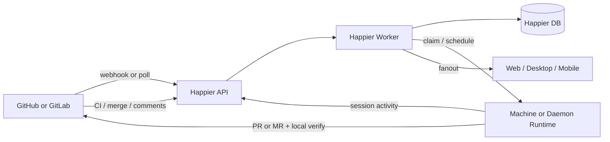

# Session-First External Issue Execution

> Status: proposed Happier plan, 2026-06-02.
>
> This plan keeps Happier session-first while adding reliable execution against
> GitHub or GitLab issues. External issues remain the planning surface. Happier
> becomes the execution control plane.

## Decision Summary

- Happier should stay session-first. Do not add a native Multica-style issue tracker as the primary product model.
- GitHub and GitLab issues remain the source of truth for planning state such as title, labels, assignee, board column, and open or closed status.
- Happier server owns the execution control plane. It should be deployed as `api` and `worker` roles, with the user machine or daemon remaining the code execution runtime.
- A new `SessionRun` model is the core execution object. It is distinct from both the external issue and the transcript session.
- Verification is a separate evidence axis, not a hard mid-flow gate. Missing remote CI must not prevent Happier from reaching a reviewable PR or MR.
- Integration should support two modes:
  - Quickstart: local credentials plus polling, for low-friction setup.
  - Managed: provider app, webhook, and token setup, for reliable server-side orchestration.

## Problem

Happier already has strong primitives for session orchestration, machine identity,
automation leasing, realtime fanout, and SCM-aware PR or MR flows. What it does
not have is a durable way to treat external GitHub or GitLab issues as inputs to
that execution system.

If Happier simply launches sessions from issue links, it remains a manual helper.
If it copies a full native issue tracker, it duplicates functionality that GitHub
and GitLab already provide and pulls the product away from its session-first
identity.

The missing layer is an execution control plane that can:

- observe issue events from GitHub or GitLab
- decide whether the issue should trigger automation
- resolve or create the correct session
- queue, lease, retry, and cancel execution attempts
- create PRs or MRs and report progress back to the provider
- preserve enough verification evidence that a human only needs to review the PR or MR

## Goals

- Keep `Session` as the primary user-facing object in Happier.
- Use external issues as the planning system without reimplementing boards, epics, or workspace planning inside Happier.
- Support automatic issue-to-session execution, not only manual launch.
- Make the control plane reliable under retries, duplicate webhooks, machine loss, and late results.
- Allow flow to continue to a reviewable PR or MR even when remote CI is not configured.
- Reuse existing Happier server, machine, session, socket, and automation infrastructure wherever possible.

## Non-goals

- Building a native issue tracker that competes with GitHub Issues or GitLab Issues.
- Replacing GitHub Projects or GitLab boards as the planning surface.
- Silently installing provider integrations without any user or admin authorization.
- Making remote CI mandatory for all repositories.
- Auto-merging code in v1.

## Industry Baseline

This plan deliberately borrows patterns from two concrete systems that already
solve adjacent parts of the problem:

| System | Concrete module | Useful pattern | Happier consequence |
| --- | --- | --- | --- |
| Multica | `server/pkg/db/queries/agent.sql`, `server/internal/service/task.go`, `server/internal/handler/github.go` | Separate issue workflow state, execution queue state, and GitHub PR or checks projection. | Happier should keep external issue planning state separate from `SessionRun` execution state and verification projection. |
| `gitlab-ai-issue` | `src/gitlab/event-normalizer.ts`, `src/workflow/issue-plan-service.ts`, `docs/11-adr/0002-state-source-and-projection.md` | Normalize provider events, keep internal state as truth, and reject late results with a state version barrier. | Happier should normalize webhook or poll events before orchestration and use `generation` on `SessionRun` to reject stale completions. |

This plan intentionally does not copy either system wholesale:

- unlike Multica, Happier remains session-first rather than issue-first
- unlike `gitlab-ai-issue`, Happier does not add a separate Trigger.dev-style orchestrator because `api` and `worker` roles already exist in Happier server

## Existing Happier Anchors

This design should extend current Happier primitives instead of adding a parallel
subsystem.

- Server process roles: `apps/server/sources/startServer.ts`, `apps/server/README.md`
- Session model: `apps/server/prisma/schema.prisma`
- Machine model: `apps/server/prisma/schema.prisma`
- Automation run state machine and leasing: `apps/server/prisma/schema.prisma`, `apps/server/sources/app/automations/automationClaimService.ts`
- Session creation entry point: `apps/server/sources/app/api/routes/session/registerSessionCreateOrLoadRoute.ts`
- Realtime fanout router: `apps/server/sources/app/events/connectionEventRouter.ts`
- GitHub OAuth provider: `apps/server/sources/app/oauth/providers/github.ts`
- GitHub webhook bootstrap: `apps/server/sources/app/auth/providers/github/webhooks.ts`
- SCM provider detection and PR or MR operations: `apps/cli/src/scm/backends/git/operations/pullRequestOperations.ts`, `apps/cli/src/scm/hostingProviders/providers/*`

## Why The Control Plane Lives In Happier Server

The control plane should not be a separate product server. It should live inside
Happier server and use its existing process split:

- `api`
  - HTTP APIs
  - auth and repo connection flows
  - webhook ingress
  - query surfaces for web, desktop, and mobile
  - session create or load entry points
- `worker`
  - async orchestration
  - event normalization
  - eligibility gates
  - session resolution
  - run queueing and leasing
  - timeout recovery and retry
  - verification aggregation
  - writeback to GitHub or GitLab
  - socket fanout through Redis-backed emitters
- `runtime`
  - actual code execution
  - local git operations
  - local verification
  - PR or MR creation

The `worker` role is still part of the control plane. It does not execute user
code. It executes the orchestration logic that makes execution reliable.

## Sources Of Truth

This design has three separate truth domains:

- Planning truth
  - GitHub or GitLab issue fields
  - labels, assignee, board position, milestones, open or closed
- Execution truth
  - Happier `SessionRun` state and event history
- Verification truth
  - Happier verification policy, attempts, suite results, and aggregated projection

These truth domains must not be collapsed into a single enum.

## High-Level Architecture



## Integration Modes

### Quickstart Mode

Quickstart minimizes setup friction.

- Uses local `gh` or `glab` auth, or a user token, where available.
- Uses polling instead of webhooks for issue and PR or MR changes.
- Supports session launch, auto PR or MR creation, and local verification.
- Provides weaker realtime guarantees and weaker team-wide consistency than managed mode.

Quickstart exists so a repo can adopt the flow before org-level provider setup is complete.
The default poller should be machine-scoped:

- the runtime machine that already has `gh` or `glab` access polls provider state
- it emits normalized `ExternalIssueEvent` payloads back to Happier server
- the worker still owns idempotency, eligibility, scheduling, and writeback policy

Server-side polling in quickstart mode is only appropriate when Happier already
holds an explicit user token for that repository.
Provider mutations in quickstart mode should usually be machine-actuated:

- the worker decides whether a comment, label sync, or other writeback should happen
- it persists a `ProviderActionRequest`
- the polling owner machine or active runtime executes that request through `gh`, `glab`, or another local auth path

### Managed Mode

Managed mode is the durable long-term architecture.

- GitHub App installation or GitLab integration is explicitly authorized once.
- Webhooks become the event source.
- Server-side writeback and remote CI sync become reliable.
- Multi-user and multi-machine orchestration becomes predictable.

Provider mutations in managed mode should be worker-actuated through the server-side integration credentials.

There is no true zero-click install path for provider integrations. GitHub and
GitLab permission models require some owner or maintainer action. The product
should optimize for low-friction authorization, not pretend it can bypass it.

## Domain Model

The minimum durable model is:

### `ExternalIssueRef`

Cached projection of a provider issue.

- provider
- providerBaseUrl
- repositoryKey
- issueNumber
- title
- state
- labels
- assignee
- url
- syncedAt

### `SessionIssueLink`

Binds sessions to issues.

- sessionId
- externalIssueRefId
- relation
  - `primary`
  - `context`
- createdBy
- createdAt

### `SessionRun`

One execution attempt against an issue-bound session.

- sessionId
- externalIssueRefId
- state
- triggerKind
- attempt
- idempotencyKey
- generation
- claimedByMachineId
- leaseExpiresAt
- branchName
- providerChangeUrl
- providerChangeNumber
- providerChangeExternalId
- headCommitSha
- baseCommitSha
- startedAt
- finishedAt

### `SessionRunEvent`

Event log for audit and UI time lines.

- sessionRunId
- type
- payload
- createdAt

### `RepositoryConnection`

Repository-scoped integration and capability projection.

- repositoryKey
- provider
- mode
  - `quickstart`
  - `managed`
- authKind
  - `github_app`
  - `gitlab_token`
  - `gh_cli`
  - `glab_cli`
  - `user_pat`
- webhookEnabled
- remoteCiDetected
- pollingOwnerMachineId
- pollingLeaseExpiresAt
- degradedReason
- installedAt
- lastCapabilitySyncAt

### `ProviderActionRequest`

Durable provider mutation intent.

- repositoryKey
- provider
- actionKind
  - `comment`
  - `label_sync`
  - `assignee_sync`
  - `issue_link_back`
  - `close_issue`
- executionMode
  - `server_worker`
  - `machine_runtime`
- targetMachineId
- idempotencyKey
- claimedByExecutorId
- leaseExpiresAt
- payload
- state
- attemptCount
- lastError
- createdAt
- updatedAt

### `VerificationPolicy`

Repo-level rules for what counts as acceptable evidence.

- repositoryKey
- requiresRemoteCi
- allowsLocalVerifyFallback
- blockingSuites
- autoMergeEligible

### `VerificationAttempt`

One concrete verification execution.

- sessionRunId
- source
  - `remote_ci`
  - `local_runtime`
  - `manual_override`
- lifecycleState
- startedAt
- finishedAt
- summary
- rawExternalId
- providerRunId
- subjectHeadSha

### `VerificationSuiteResult`

Per-suite result inside a verification attempt.

- verificationAttemptId
- suiteKey
- conclusion
- durationMs
- artifactUrl
- summary

### `VerificationProjection`

Latest aggregated review-facing summary.

- sessionRunId
- headline
  - `verified_remote`
  - `verified_local_only`
  - `partially_verified`
  - `unverified`
  - `verification_failed`
  - `verification_pending`
- blockingState
  - `clear`
  - `warning`
  - `blocked`
- updatedAt

### `MergeabilityProjection`

Provider merge-gate summary for the current PR or MR head.

- sessionRunId
- mergeabilityState
  - `mergeable`
  - `blocked_required_checks`
  - `blocked_reviews`
  - `blocked_conflicts`
  - `draft`
  - `unknown`
- requiredChecksOutstanding
- requiredReviewsRemaining
- subjectHeadSha
- updatedAt

### Optional `ExternalIssueSyncCursor`

Useful for polling mode or provider replay recovery.

- provider
- repositoryKey
- cursor
- syncedAt

## State Model

The design needs three separate state axes.

### Workflow Axis

Review-facing progression.

```text
idle -> executing -> change_open -> awaiting_review -> done
```

This is what users care about at the top level.
Interpretation rules:

- `change_open` means a provider change exists, but automation may still be iterating on it
- `awaiting_review` means automation considers the current head ready for human review under repository policy

### Execution Axis

Durable orchestration state.

```text
queued -> claimed -> running -> waiting_user -> succeeded -> failed -> cancelled -> expired
```

This is the actual control-plane state.

### Verification Axis

Evidence state, independent of workflow.

- Attempt lifecycle
  - `queued`
  - `running`
  - `completed`
  - `failed`
  - `cancelled`
  - `timed_out`
- Suite conclusions
  - `passed`
  - `failed`
  - `pending`
  - `skipped`
  - `neutral`
  - `action_required`
  - `unknown`
- Aggregated projection
  - `verified_remote`
  - `verified_local_only`
  - `partially_verified`
  - `unverified`
  - `verification_failed`
  - `verification_pending`

The important rule is:

- verification evidence changes review confidence
- missing verification evidence does not stop Happier from reaching `awaiting_review`
- failed verification should normally trigger another automation attempt before human review, until retry budget or policy says otherwise
- mergeability is tracked separately from verification and reviewability

If a repository uses branch protection or required checks, GitHub or GitLab
remains the final merge gate. Happier should surface that fact. It should not
pretend that local verification is equivalent to protected-branch success.
`awaiting_review` therefore means "a human can now inspect the change", not
"the provider will currently allow merge".

## Event Pipeline

The orchestration pipeline should be:

```text
ExternalIssueEvent
-> idempotency check
-> eligibility gates
-> session resolution
-> SessionRun queued
-> machine claim and lease
-> runtime execution
-> PR or MR creation
-> verification aggregation
-> awaiting_review
-> provider merge event
-> done
```

When a PR or MR already exists for the issue, later implementation or repair
runs should usually reuse the same provider change and branch rather than open a
new one. The default repair loop is:

```text
verification_failed
-> follow-up SessionRun queued on the existing provider change
-> runtime pushes a fix to the same branch
-> verification recomputes on the new head
```

### Event Normalization

Provider-specific webhooks or poll diffs should first normalize into an internal event format:

- `issue.opened`
- `issue.reopened`
- `issue.labeled`
- `issue.assigned`
- `issue.comment.created`
- `provider_change.opened`
- `provider_change.synchronized`
- `provider_change.merged`
- `pipeline.updated`

The control plane should operate on normalized events, not directly on raw webhook payload shapes.

`RepositoryConnection` decides which event sources are active for a repository:

- managed mode prefers provider webhooks
- quickstart mode prefers machine-originated poll events
- both modes may still use polling as a repair path for missed events

## Performance And Scaling

The control plane should make its complexity explicit:

- event ingestion is `O(1)` per normalized event plus provider payload parse cost
- session resolution must be `O(k)` where `k` is the number of candidate sessions for the same repository, never a global scan across all sessions
- active run lookup must be index-backed on repository, issue, and active-state fields
- verification projection update is `O(s)` where `s` is the number of suites in the latest attempts being merged
- quickstart polling is `O(r)` per owner machine where `r` is the number of repositories assigned to that poller; each repository must carry its own cursor and backoff state

Implementation consequences:

- maintain a repository-to-session candidate index
- use unique constraints to prevent more than one active primary run per external issue unless a repository explicitly enables parallel execution
- keep polling cursors per repository instead of rescanning entire issue lists
- treat remote CI updates as incremental by external run id, not full pipeline snapshots
- correlate provider PR or MR events and CI updates by provider change identity plus head SHA, not by URL text alone

### Idempotency

Every external event must carry or derive an idempotency key. Duplicate webhook
deliveries must not create duplicate runs. Polling mode must use event cursors or
content-version comparisons to avoid replay storms.

### Late Result Rejection

`SessionRun` needs a `generation` or equivalent monotonic barrier. A stale worker
or runtime result must not overwrite a newer run state after retry or manual rerun.
The same rule applies to verification and mergeability: CI or provider updates
for an older `headCommitSha` must not replace the projection for the current head.

## Eligibility Rules

Automatic execution is rule-driven, not implicit.

Recommended initial rules:

- repository is allowlisted
- issue is open
- issue is not labeled `blocked` or `waiting-human`
- issue has an automation label such as `ai` or `happier`
- or issue has a bot assignment
- or a trusted comment includes `/run`
- no active primary run already exists for the external issue unless repository policy explicitly enables parallel execution

Recommended operator commands:

- `/run`
- `/retry`
- `/abort`

Command handling must verify actor permissions before enqueuing control-plane actions.

## Session Resolution

Session-first automation only works if session resolution is explicit.

Recommended resolution order:

1. Reuse an active session already linked as the primary session for the issue.
2. Reuse an eligible session in the same repository when policy allows it.
3. Reuse a long-lived repository session only when it has no conflicting active issue.
4. Otherwise create a new session.

Guardrails:

- default to one active primary issue per execution session
- default to one active primary session per open external issue
- do not reuse poisoned, stuck, or explicitly archived sessions
- force a new session if context length or session age exceeds policy
- require a fresh session when branch isolation is needed

Each resolution must record a reason for observability and debugging.

## SessionRun Scheduling

`SessionRun` is the core execution object. It should reuse the proven semantics
already present in automation leasing:

- queueing
- claim by machine
- lease expiry
- heartbeat
- timeout recovery
- retry policy
- cancellation

Recommended invariants:

- only one active primary run per external issue unless a repository policy explicitly enables parallel execution
- only one primary `SessionIssueLink` should exist for an open issue at a time
- comment-triggered reruns should coalesce into a next run if a run is already active
- infrastructure failures may retry automatically
- user-requested aborts must be immediate and terminal
- results arriving after lease loss are ignored
- provider action execution must be idempotent per `ProviderActionRequest.idempotencyKey`

Manual launch must respect the same invariants. If an issue already has an
active primary run, manual launch should attach to the existing execution or
queue a follow-up run, not create a second competing primary execution path.

## Failure And Recovery

The control plane needs explicit degraded-mode behavior.

### Poller Ownership Failure

Quickstart mode must not assume polling is always available.

- only the machine holding the active poll lease for `RepositoryConnection` may emit poll-derived events
- if `pollingLeaseExpiresAt` lapses or the machine goes offline, the repository enters degraded mode
- degraded mode pauses automatic issue triggers but must not block manual session launch or already-running sessions
- a worker may reassign polling to another eligible machine, or the UI may prompt the user to reconnect the repository

### Runtime Loss During Execution

- if a machine loses its run lease before completion, the run becomes `expired`
- the worker decides whether to retry by creating a new `SessionRun` attempt or leave the run failed for human inspection
- stale completions from the lost machine are ignored through the `generation` barrier
- if a provider change already exists for the issue, retry should default to reusing that branch and PR or MR

### Provider And Writeback Failure

- provider comments, labels, or link-back updates should be written through retryable `ProviderActionRequest` records, not inline-only side effects
- writeback failure must not erase a successful PR or MR creation outcome
- if a PR or MR exists but writeback is delayed, Happier should still advance to `awaiting_review` and mark provider sync as degraded
- both worker-side and machine-side provider actions need claim plus lease semantics so duplicate executors cannot post the same mutation twice

### Event Loss Recovery

- managed mode should periodically run a repair poll to backfill missed webhook deliveries
- quickstart mode should persist the last successful cursor per repository so a restarted poller can resume without replay storms
- reconciliation jobs should compare provider PR or MR state, issue state, and local run state to repair drift

## Verification Model

Verification needs more structure than a single enum.

### Verification Policy

Policy answers what the repo expects.

Examples:

- does this repo require remote CI before merge
- which suites are blocking
- is local runtime verification an acceptable fallback
- are documentation-only changes exempt from some suites

### Verification Attempts

Every verification execution is recorded separately.

Examples:

- local runtime runs `lint`, `typecheck`, `test`, or `build`
- GitHub Actions workflow run updates a remote attempt
- GitLab pipeline updates a remote attempt

Remote verification must correlate to the active run by provider change identity
and `subjectHeadSha`. A passed pipeline for an older head must remain historical
evidence, not upgrade the newest run's verification projection.

### Verification Projection

UI surfaces should show a compact view:

- remote verified
- locally verified only
- partially verified
- unverified
- verification failed

This projection supports the product goal:

- the human reviews the PR or MR
- the human does not need to manually drive mid-flow orchestration

### Mergeability Projection

Mergeability is not the same thing as verification.

Examples:

- all tests passed, but branch protection still requires one human approval
- local verification passed, but required remote checks are missing
- the PR or MR is still draft even though the implementation run succeeded

The UI should therefore display:

- review evidence from `VerificationProjection`
- provider merge-gate status from `MergeabilityProjection`

### No-CI Repositories

Missing remote CI must not stop flow.

Instead:

- if remote CI exists, ingest it as strong evidence
- if remote CI does not exist, run local verification and surface it as weaker evidence
- if neither exists, still create the PR or MR and mark it as unverified

In all three cases, Happier can continue to `awaiting_review`.

An optional follow-up automation may open a separate bootstrap PR or MR that adds
minimal CI configuration. That bootstrap task must not block the original issue.
If provider branch protection makes the change temporarily unmergeable, that
must surface through `MergeabilityProjection` rather than by mutating the main
workflow back out of `awaiting_review`.

### Failed Verification

Failed verification is different from missing verification.

Default policy:

- if local or remote verification fails, keep the workflow at `change_open`
- enqueue a follow-up `SessionRun` against the same provider change and branch
- attach failure evidence to the run so the agent can repair the exact failure
- only transition to `awaiting_review` after verification passes, retry budget is exhausted, or repository policy explicitly allows review with failing automation

This keeps the human at the final PR or MR review step in the common case,
instead of forcing manual intervention on the first red test run.

## End-To-End Flows

### Managed Mode

1. Maintainer installs the GitHub App or configures the GitLab integration.
2. Provider sends issue webhook to Happier API.
3. Worker normalizes the event and checks idempotency.
4. Worker applies eligibility rules.
5. Worker upserts `ExternalIssueRef`.
6. Worker resolves or creates the target session.
7. Worker creates `SessionRun` in `queued`.
8. Machine claims the run and begins execution.
9. Runtime updates the session, creates a branch, and opens a PR or MR.
10. Runtime runs local verification and records `VerificationAttempt`.
11. Provider CI updates arrive asynchronously and refine verification evidence.
12. If verification fails, worker queues a repair run on the same branch and PR or MR until retry budget or policy stops the loop.
13. Worker writes back summary comments or labels as configured.
14. Once the current head is review-ready, the run reaches `awaiting_review`.
15. Human reviews the PR or MR and merges.
16. Provider merge webhook transitions the linked issue and run to `done`.

### Quickstart Mode

1. User authenticates locally through `gh`, `glab`, or a repo token.
2. Poller observes issue or PR or MR state changes.
3. Worker follows the same normalized event pipeline as managed mode.
4. Runtime performs local execution and PR or MR creation.
5. Verification is primarily local unless the repo already exposes remote CI signals.
6. Failed verification triggers follow-up repair runs on the same branch until retry budget or policy stops the loop.
7. Human reviews and merges the PR or MR.

The rest of the control plane is shared. Only the event source and reliability profile differ.

## Writeback Strategy

Writeback should be incremental.

Safe defaults:

- add progress comments
- add summary comment on completion
- link PR or MR URL back to the issue

Optional later writeback:

- synchronize labels
- move issue state
- update assignee

Aggressive provider mutation should be opt-in. Teams often have existing human workflows and provider automations.

## Security And Authorization

- Quickstart mode uses user-scoped credentials and therefore should scope actions to repos the user can already access.
- Managed mode uses provider app installation scopes and must limit repo access to the installed set.
- Issue commands such as `/run`, `/retry`, and `/abort` must verify actor permissions.
- Session and run data must remain constrained by existing Happier account, session, and machine authorization boundaries.
- Webhook authenticity must be verified before event normalization.

## Test Strategy

This feature needs tests at multiple layers. The implementation is not complete
unless these are added with each phase.

### Unit Tests

- provider event normalization
- eligibility and command gating
- session resolution policy
- verification projection aggregation
- degraded-mode and retry policy decisions

### Integration Tests

- webhook or poll event to `SessionRun` queue creation
- run lease expiry and retry
- late-result rejection after rerun
- writeback outbox retries
- provider merge event closing the loop to `done`
- old-head CI result does not overwrite current-head verification or mergeability
- duplicate `ProviderActionRequest` execution is rejected by idempotency plus lease checks
- failed verification enqueues a repair run on the same branch and PR or MR

### End-To-End Slices

- GitHub managed mode, new issue to PR
- quickstart mode, machine-owned polling to PR
- no-CI repository, local verification only, reaches `awaiting_review`
- repository connection degradation and recovery

## Implementation Plan

### Phase 1

- Add `ExternalIssueRef` and `SessionIssueLink`
- support manual launch from an external issue
- support PR or MR writeback
- expose issue context in session UI

### Phase 2

- Add `SessionRun`
- implement eligibility gates
- implement session resolution
- reuse automation-style claim, lease, retry, and cancel semantics
- support automatic execution from normalized events

### Phase 3

- add verification policy, attempts, suites, and projection
- run local verification from runtime
- ingest remote CI results
- surface review evidence in UI

### Phase 4

- add CI bootstrap PR or MR automation
- add richer provider sync and label mapping
- add repo-level policy editors
- add bulk scheduling and org-wide rollout controls

## Implementation Notes

Recommended first code landing points:

- companion Prisma and API draft: `docs/plans/session-first-external-issues-schema-api.md`
- provider event normalization under `apps/server/sources/app/integrations/`
- run orchestration under `apps/server/sources/app/sessionRuns/`
- verification aggregation under `apps/server/sources/app/verification/`
- repo policy and issue bindings in Prisma schema plus matching route and service layers
- session UI additions in the existing session details or sidebar surfaces

The first implementation should prefer vertical slices over a full framework.
One good slice is:

- GitHub managed mode
- issue label gate
- new session creation only
- one run per issue
- local verification only
- PR creation plus summary comment

That slice proves the architecture without over-committing to advanced reuse policies.

## Open Questions

- Should GitLab managed mode use project webhooks plus token bootstrap, or a fuller app-style integration if the product wants parity with GitHub App ergonomics.
- Should long-lived repository sessions be product-visible, or remain an internal optimization behind session resolution policy.
- How much of provider board status should be projected into Happier session UI versus left entirely in GitHub or GitLab.
- Whether verification policy belongs per repository, per branch, or per session template.
